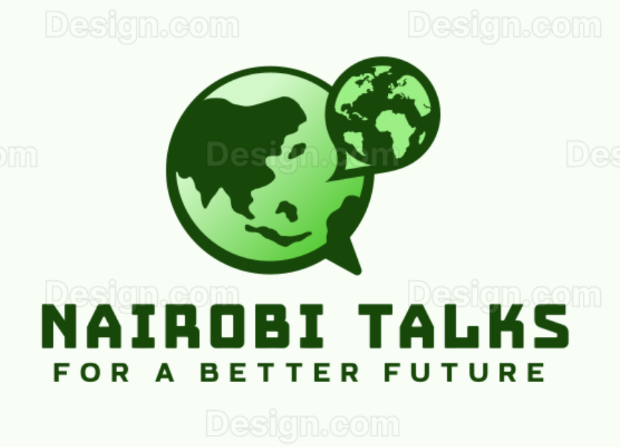

# NairobiTalks

A comprehensive Rails application for managing citizen submissions and community engagement in Nairobi, Kenya. This platform enables citizens to submit feedback, ideas, and concerns while providing administrators with powerful tools to manage, filter, and respond to submissions effectively.

## 🌟 Features

### Citizen Features

- Submit community ideas, planning documents, and feedback via easy forms
- Track submission status on personal dashboard
- Comment on ideas and participate in discussions
- Vote (upvote/downvote) on ideas with clear tick/X buttons
- View idea details and community engagement

### Administrator Features

- Admin dashboard for managing submissions, users, and planning documents
- Forum management: schedule, moderate, and analyze civic engagement forums (online meetups, text-based discussions)
- Broadcast center: create, send, and track public announcements to citizens
- Filter submissions by status, type, and date
- Perform bulk actions (approve, reject, flag) on multiple submissions
- Update and display submission statuses with visual indicators
- Access analytics and charts for platform activity

### General Platform Features

- Responsive design for desktop and mobile
- Secure authentication for citizens and admins
- Real-time updates for status and voting

## 🛠 Technology Stack

- **Backend**: Ruby on Rails 8.1.1
- **Frontend**: Bootstrap 5, Turbo/Stimulus
- **Database**: SQLite (development), PostgreSQL (production)
- **Authentication**: Devise
- **File Storage**: Active Storage
- **AI Integration**: OpenAI API for content analysis
- **Deployment**: Ready for Kamal deployment

## 🚀 Quick Start

### Prerequisites

- Ruby 3.2.0 or higher
- Rails 8.1.1
- Node.js and Yarn
- PostgreSQL (for production)

### Installation

1. **Clone the repository**

   ```bash
   git clone https://github.com/mamatechafrica/NairobiTalks-NCG.git
   cd NairobiTalks-NCG
   ```

2. **Install dependencies**

   ```bash
   bundle install
   yarn install
   ```

3. **Database setup**

   ```bash
   rails db:create
   rails db:migrate
   rails db:seed
   ```

4. **Environment configuration**

   ```bash
   cp config/credentials.yml.enc.example config/credentials.yml.enc
   # Edit credentials as needed
   ```

5. **Start the application**

   ```bash
   rails server
   ```

Visit `http://localhost:3000` to access the application.

## 📁 Project Structure

This application is organized into three main modules:

- **Admin Module** (`admin` branch): Administrative interface for managing submissions
- **Public Module** (`main` branch): Public-facing citizen submission forms
- **API Module** (`api` branch): RESTful API for external integrations

## 🔧 Development

### Running Tests

```bash
rails test
```

### Code Quality

```bash
rubocop
brakeman
```

### Database Management

```bash
rails db:migrate
rails db:rollback
```

## 🤝 Contributing

1. Fork the repository
2. Create a feature branch (`git checkout -b feature/amazing-feature`)
3. Commit your changes (`git commit -m 'Add some amazing feature'`)
4. Push to the branch (`git push origin feature/amazing-feature`)
5. Open a Pull Request

## 📄 License

This project is licensed under the MIT License - see the [LICENSE](LICENSE) file for details.

## 🙏 Acknowledgments

- Built for the Nairobi County Government
- Powered by Ruby on Rails and modern web technologies
- Designed to enhance citizen participation in local governance

## 📞 Support

For support or questions, please contact the development team or create an issue in this repository.

---

**NairobiTalks** - Connecting Citizens with Their Government
